##  HomeTiles

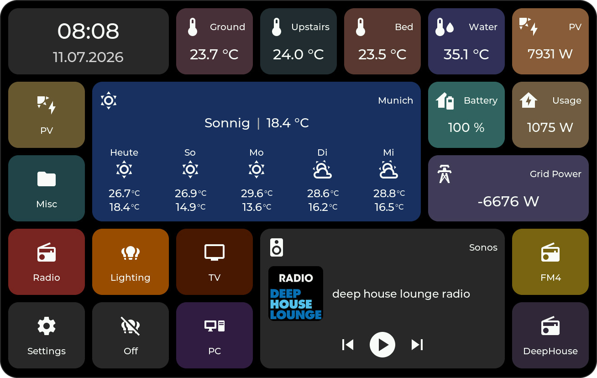

Tile-based ESP32-P4 firmware for Home Assistant dashboards with a fully configurable web interface.

The project supports multiple ESP32-P4 touch displays and combines:

- touch-first, tile-based dashboard UI
- MQTT-based Home Assistant integration
- on-device settings: WiFi setup, display, language, firmware updates
- firmware updates directly on the device (GitHub releases) or via the web interface
- full dashboard configuration through the built-in web admin panel

 

## Requirements

- Home Assistant
- MQTT broker
- The Home Assistant bridge/integration:
  [HomeTiles Bridge](https://github.com/GalusPeres/HomeTiles-Bridge)

New to this? The [Home Assistant Setup Guide](docs/home-assistant-setup.md) walks through
the whole chain: MQTT broker, bridge integration, and connecting the display.

## Documentation

**Full documentation: https://galusperes.github.io/HomeTiles/**

- [Flashing the Firmware](docs/flashing.md) — first installation over USB, factory images
- [Home Assistant Setup Guide](docs/home-assistant-setup.md) — MQTT broker, bridge integration, first connection
- [Bridge Integration](docs/bridge.md) — installation, panel settings, entity configuration
- [Web Admin Panel](docs/web-admin.md) — creating tiles, drag & drop, folders, import/export
- [On-Device UI](docs/device-ui.md) — popups and on-device settings, with screenshots
- [Tile Types](docs/tiles.md) — every tile type and what it needs
- [Firmware Updates](docs/updating.md) — on-device updater, web OTA, factory flash
- [FAQ & Troubleshooting](docs/faq.md) — common questions and known quirks
- [BOARD_SETTINGS.md](BOARD_SETTINGS.md) — Arduino IDE build settings per device

## Highlights Of The v0.4.x Releases

- Redesigned web admin panel: live tile grid preview, pinned tile settings panel, smoother drag & drop, and per-folder selection memory
- Firmware updates from the browser: the web admin can now run the GitHub update check itself, in addition to the manual file upload
- New on-device WiFi **Disconnect** button (keeps the saved credentials) and a **Pairing** button that re-announces the device to Home Assistant without touching any settings
- Consistent button colors across the device, web admin, and captive portal: green for go-actions, red only for deleting
- Anti-aliased UI rendering — no more jagged edges on switches, sliders, and popup corners
- More reliable on-device GitHub updates: the installer now downloads the image in one pass, fixing a crash that could occur mid-update
- Screenshot export now uses the hardware JPEG encoder
- Built-in crash diagnostics: after a crash the device writes a crash log and keeps a core dump, both downloadable from the web admin — see [FAQ](https://galusperes.github.io/HomeTiles/faq/#the-display-crashed-or-restarted-by-itself) for how to report a crash

Highlights of the v0.3.x releases

- New in v0.3.1: automatic device pairing — a freshly connected device (no MQTT credentials configured on it yet) announces itself on the network, shows up as a "discovered device" card in Home Assistant, and the bridge pushes your existing MQTT broker's credentials to it automatically once confirmed. No manual host/user/password entry required on the device itself.
- Fixed in v0.3.3: the display could wake itself up out of sleep — without being touched — whenever a background data update arrived. It now only wakes on an actual touch, and tiles stay up to date in the background the whole time it's asleep, so there's no lag when you do wake it.
- Fixed in v0.3.2: saving a tile (or importing a tile layout) into a folder that had never been saved before — most notably the Home screen right after a first-time setup or full factory reset — always failed. Fresh installs work correctly now.
- Project rebranded to **HomeTiles** (formerly ESP32-P4-HomeAssistant-Display) — existing devices keep updating automatically across the rename
- New boot splash screen: logo, firmware version, and device name shown briefly on startup before the dashboard loads
- Polished branding across the on-device System popup and the web admin panel
- More reliable tile storage: tile grids and the folder index are written atomically, avoiding partial/corrupted saves
- Smoother MQTT behavior under load, with traffic throttled during heavy rendering/DMA activity

Highlights of the v0.2.x releases

- All three supported devices are now covered by every release
- Firmware updates directly from the device: Settings → System checks GitHub for new releases and installs them over the air
- Reworked on-device settings: WiFi network scan with on-screen keyboard, Access Point mode with QR code, display/brightness/sleep options, language and time settings, restart button
- Major rendering performance improvements on the M5Stack Tab5 and the Waveshare 8" display (hardware-accelerated rotation, faster draw paths)
- General UI polish across tiles and popups

## Overview

This firmware turns supported ESP32-P4 touch displays into configurable Home Assistant control panels.

Everything visible on the dashboard is tile-based and managed from the built-in web interface:
- add, remove, move, and resize tiles
- drag and drop tiles between positions directly in the web interface
- configure tile content and behavior
- create folders and navigation structures
- manage WiFi, MQTT, language, and time zone settings without changing code

## Supported Devices

- [M5Stack Tab5](https://shop.m5stack.com/products/m5stack-tab5-iot-development-kit-esp32-p4)
- [Waveshare ESP32-P4-WIFI6-Touch-LCD-4B](https://www.waveshare.com/esp32-p4-wifi6-touch-lcd-4b.htm)
- [Waveshare ESP32-P4-WIFI6-Touch-LCD-8 (8 inch)](https://www.waveshare.com/esp32-p4-wifi6-touch-lcd-7-8-10.1.htm)

Device-specific Arduino IDE settings are documented in [BOARD_SETTINGS.md](BOARD_SETTINGS.md).

## Screenshots

Captured on the Waveshare 8" — the same firmware and web admin panel run on all supported devices.

### On The Device

Home dashboard, folder view, and the settings menu:

 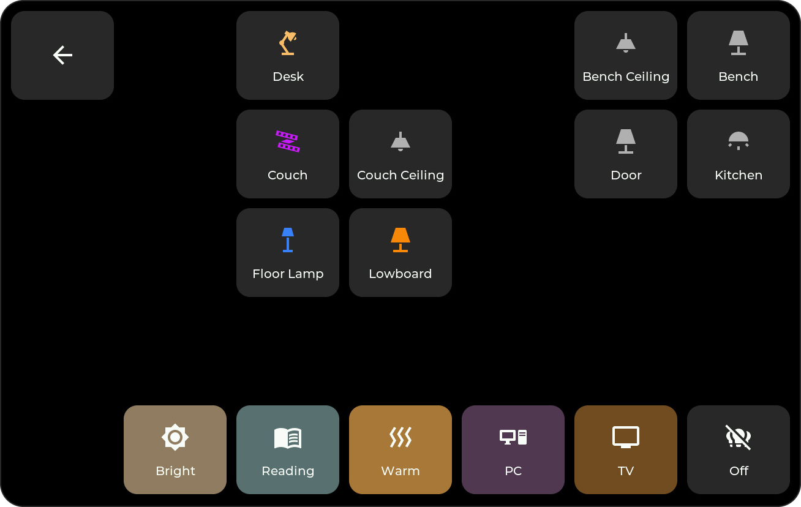 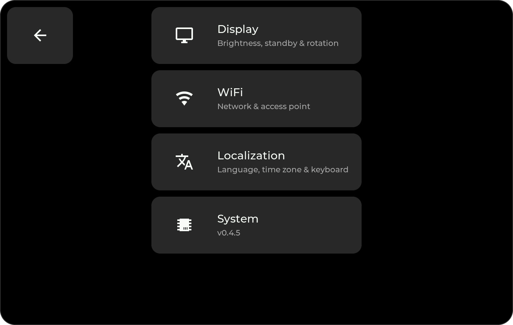

### Popups

Light control — brightness, color, and color temperature:

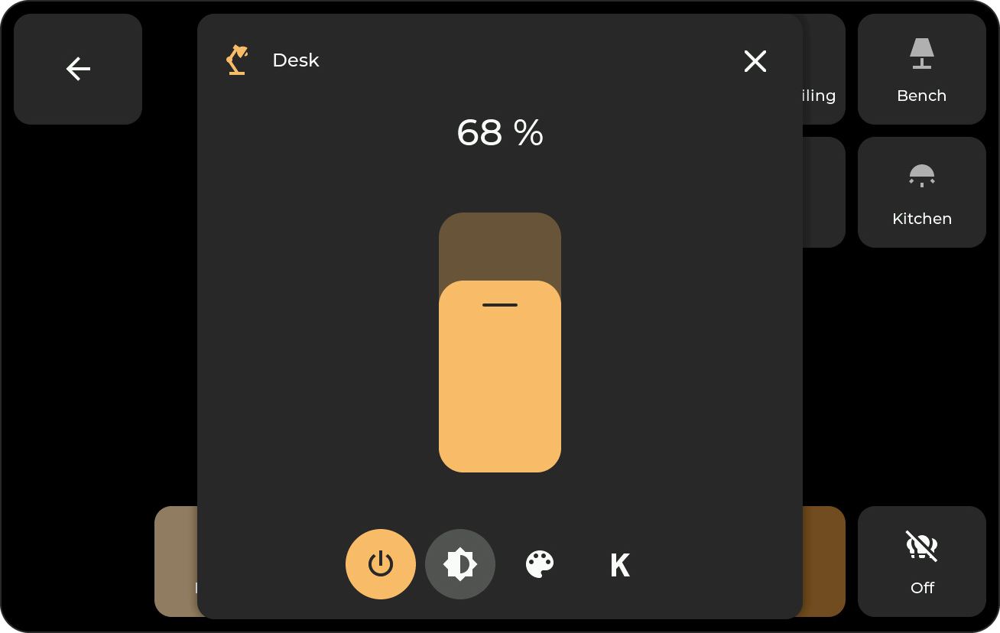 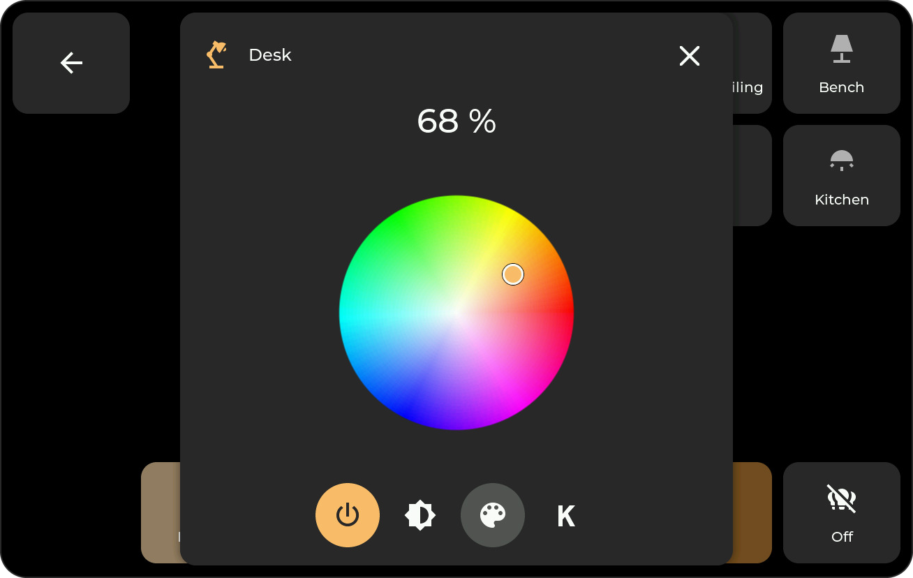 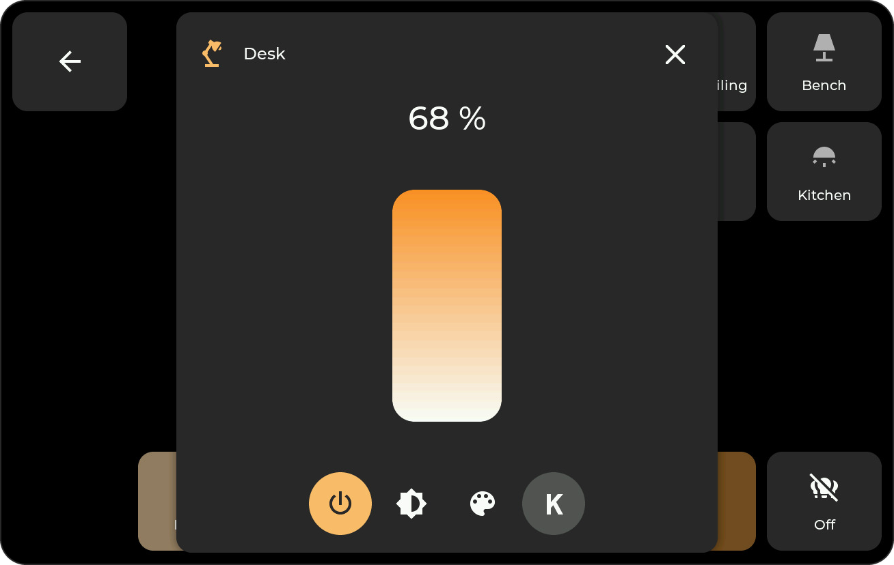

Energy statistics (day and week) and sensor history:

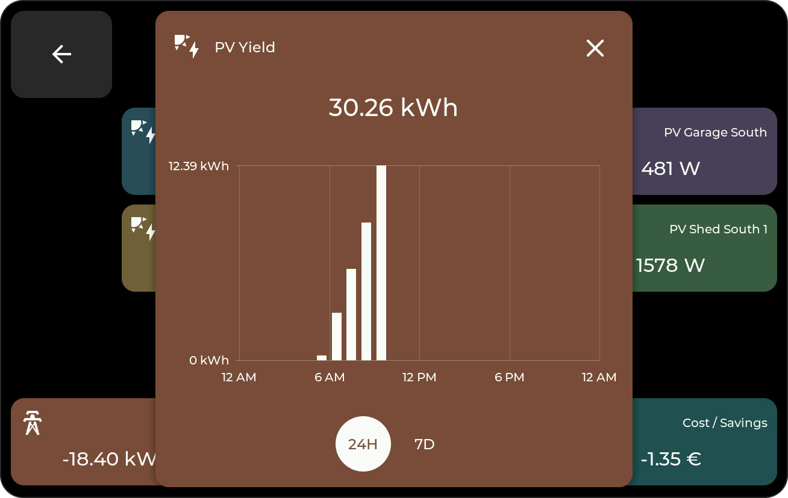 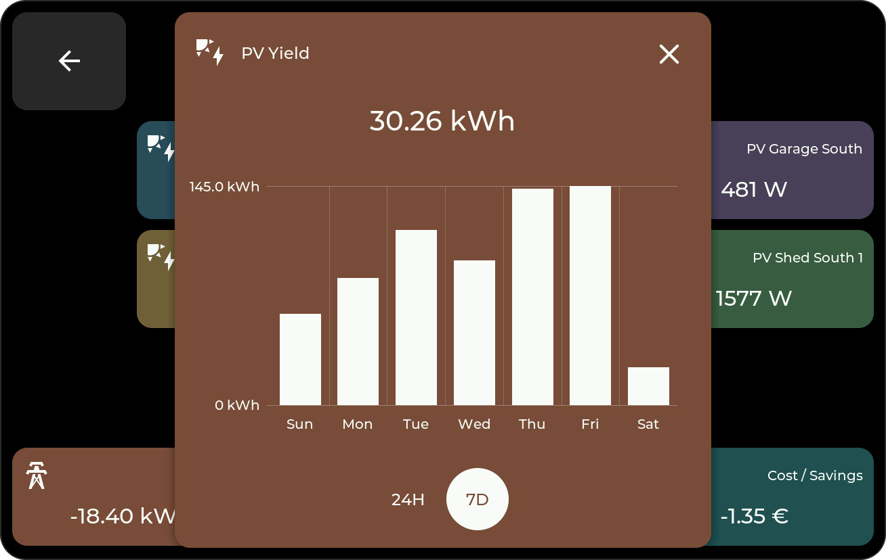 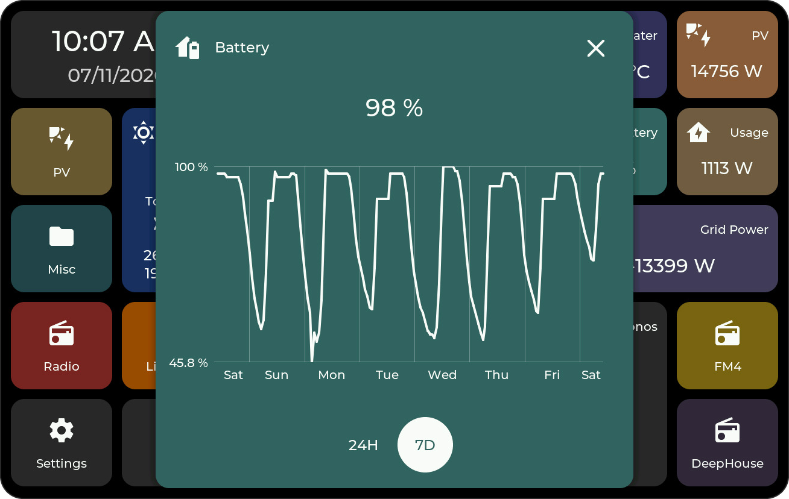

Weather forecast, media player, and the system popup with the built-in updater:

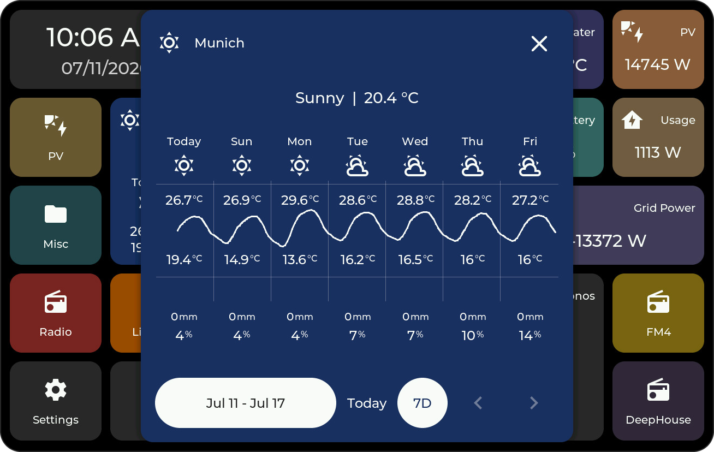 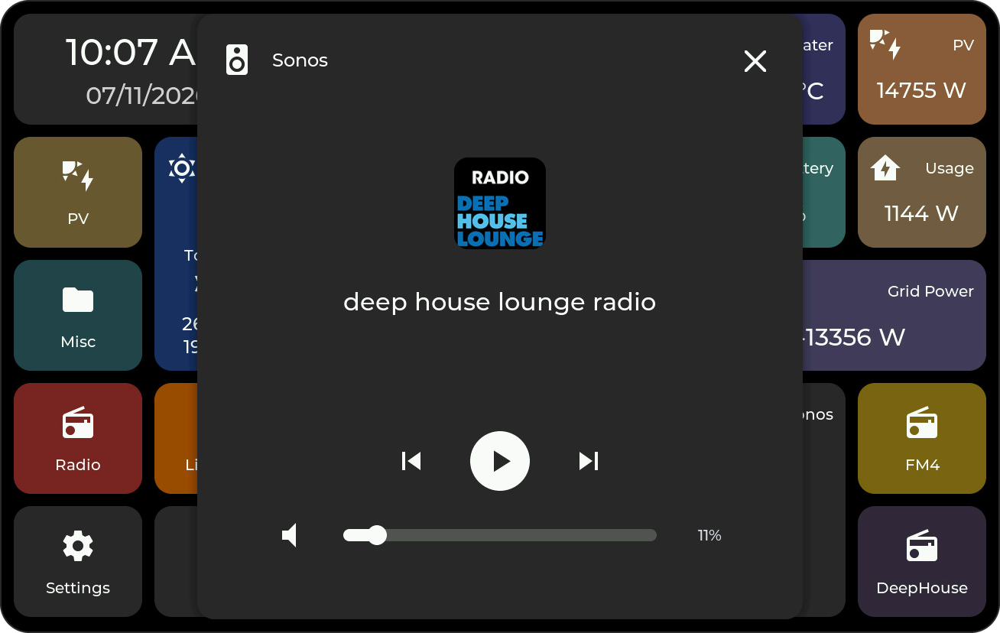 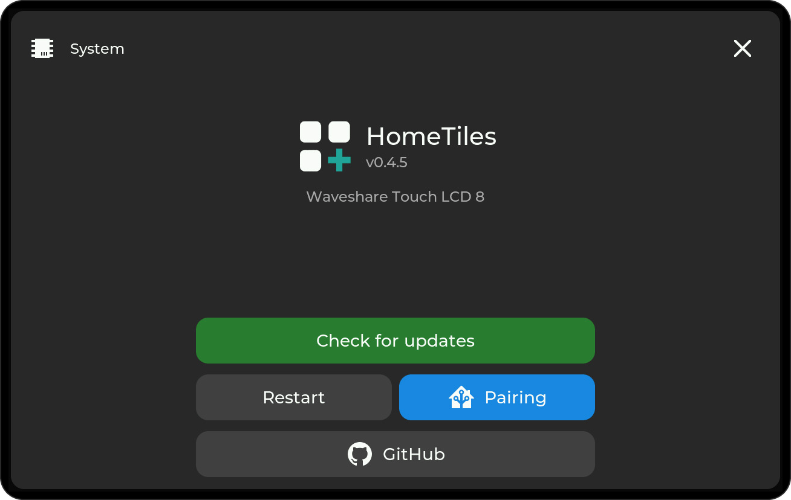

### Web Admin Panel

The dashboard is built entirely in the browser — click a tile to edit it, drag & drop to move it, every change saves automatically:

  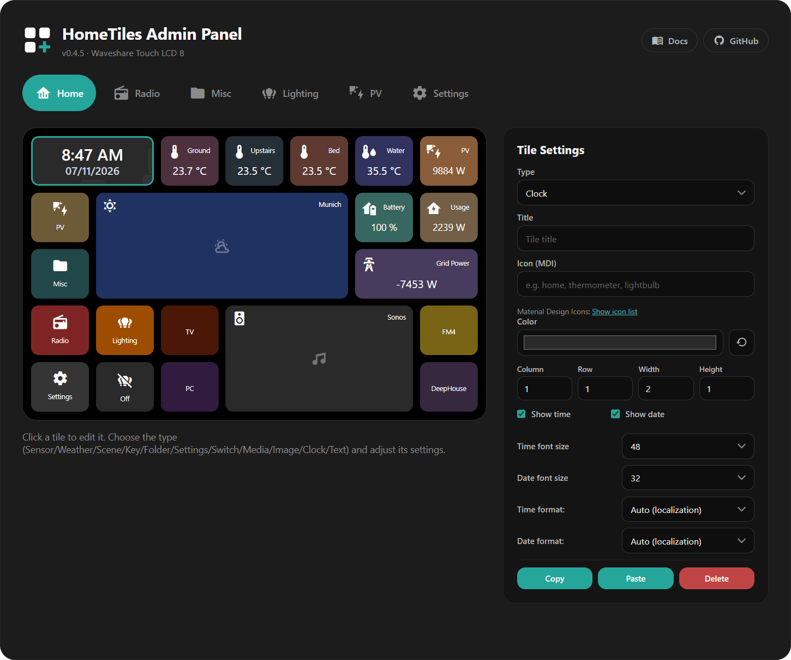

WiFi, MQTT, and localization settings without touching code:

  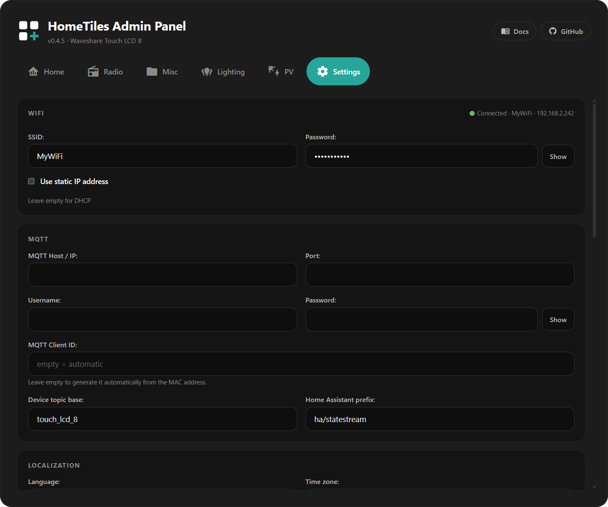

More screenshots and how everything works: [Web Admin Panel](docs/web-admin.md) and [On-Device UI](docs/device-ui.md).

## Features

- Firmware updates directly on the device (checks GitHub releases, installs over the air)
- OTA firmware upload from the built-in web admin panel
- Fully tile-configurable dashboard via the built-in web admin panel
- Drag-and-drop tile layout editing in the web admin panel
- MQTT-based Home Assistant communication
- On-device WiFi setup: network scan with on-screen keyboard, or Access Point mode with QR code
- On-device settings for display brightness, sleep, orientation, language, time zone, and time format
- English and German UI/admin support, 12h/24h time formats
- Home Assistant energy statistics tile with day and week popup charts
- Media player tile with cover art and playback controls
- microSD file manager in the web admin (upload, download, rename, delete, folders)
- Runtime storage on internal LittleFS; microSD is optional
- Screenshot export to microSD from the web interface
- Tile types currently include: sensor, energy, weather, scene, switch, media,
  folder, clock, text, counter, key, animation, and empty — see [Tile Types](docs/tiles.md)

## Installation

### Option 1: Prebuilt Binaries

Download the files matching your device from the [latest release](https://github.com/GalusPeres/HomeTiles/releases/latest):

| Device | First flash | OTA update file |
| --- | --- | --- |
| M5Stack Tab5 | `..._m5stacks_tab5_factory.bin` | `..._m5stacks_tab5.bin` |
| Waveshare 4B | `..._waveshare_4b_factory.bin` | `..._waveshare_4b.bin` |
| Waveshare 8" | `..._waveshare_touch_lcd_8_factory.bin` | `..._waveshare_touch_lcd_8.bin` |

Use:
- `factory.bin` for a clean first flash (ESP Flash Download Tool at address `0x00000`)
- the plain `.bin` for OTA updates of an existing device (web admin upload)

A manual reset after flashing may be required.

### Option 2: Update From The Device

Devices already running a recent firmware version can update themselves:
open `Settings` → `System` → check for updates. The device finds the
latest GitHub release and installs it directly.

### Option 3: Build From Source

1. Open [HomeTiles.ino](HomeTiles.ino) in the Arduino IDE.
2. Select the target device in [src/devices/device_select.h](src/devices/device_select.h).
3. Apply the correct board settings from [BOARD_SETTINGS.md](BOARD_SETTINGS.md).
4. Build and flash the firmware.

## First Setup

1. Flash the firmware and boot the device.
2. Open `Settings` → `WiFi` on the device. Either:
   - pick your network from the scan list and enter the password with the on-screen keyboard, or
   - enable Access Point mode: connect to the device hotspot (password `12345678`, QR code shown on screen) and enter your WiFi credentials in the captive portal.
3. After saving, the device restarts and connects to your WiFi network.
4. The device IP address is shown in the on-device WiFi settings.
5. Open the web admin panel through that IP address.
6. Install the [HomeTiles Bridge](https://github.com/GalusPeres/HomeTiles-Bridge) integration in Home Assistant, if you haven't already.
7. As long as the device has no MQTT credentials configured on it yet, it announces itself on the network automatically. A "discovered device" card appears under Settings → Devices & Services in Home Assistant — confirm it, and the bridge pushes your existing MQTT broker's credentials to the device for you, no typing required.
   - Alternatively, enter MQTT host/user/password by hand in the device's web admin panel — see the [Home Assistant Setup Guide](docs/home-assistant-setup.md) for the full walkthrough either way.
8. Configure your tiles, folders, and layout.

Optional:
- Insert a FAT32-formatted microSD card if you want to use the file manager or screenshot export from the web interface.

## Home Assistant Integration

This firmware expects the Home Assistant side to be provided by the MQTT bridge/integration:

- [HomeTiles Bridge](https://github.com/GalusPeres/HomeTiles-Bridge)

That integration handles the Home Assistant-side MQTT communication and entity bridge.
For Energy tiles, Home Assistant energy statistics, live icon updates, and popup history, use the current bridge release.

Step-by-step instructions (broker, integration, display): [Home Assistant Setup Guide](docs/home-assistant-setup.md)

## Repository Structure

- `src/` firmware source code
- `docs/images/` screenshots and documentation images
- `electron-app/` desktop companion tooling
- `mdi-extractor/` icon tooling
- `simconnect-bridge/` additional companion tooling
- `BOARD_SETTINGS.md` documented Arduino IDE board settings

## Known Issues

- M5Stack Tab5: Access Point mode is currently only reliable with a battery installed. Without a battery, keep brightness at the lowest available level; otherwise the device can crash. (Since v0.2.9 the firmware automatically caps the backlight around AP start and WiFi reconnects to prevent brownouts.)
- Waveshare 4B / 8": the display can briefly flash blue whenever the firmware writes to internal flash (saving tile edits, OTA installs). This is a cosmetic MIPI-DSI underrun — the panel framebuffer lives in PSRAM, and flash writes stall PSRAM access. The precompiled Arduino core does not enable `CONFIG_SPIRAM_XIP_FROM_PSRAM`, which would fix this; it cannot be enabled from the sketch.

## Notes

- A microSD card is not required for normal operation; it is only used for the web file manager and screenshot export.
- Board selection and board settings must match the target device.
- A Windows Electron companion app also exists under `electron-app/`. It can be used to send PC-side data to the device, for example Microsoft Flight Simulator values, system metrics, or simulated keyboard input/commands for Windows. This still needs proper documentation and its own release packaging.

## License

This project is licensed under the MIT License. See [LICENSE](LICENSE).
