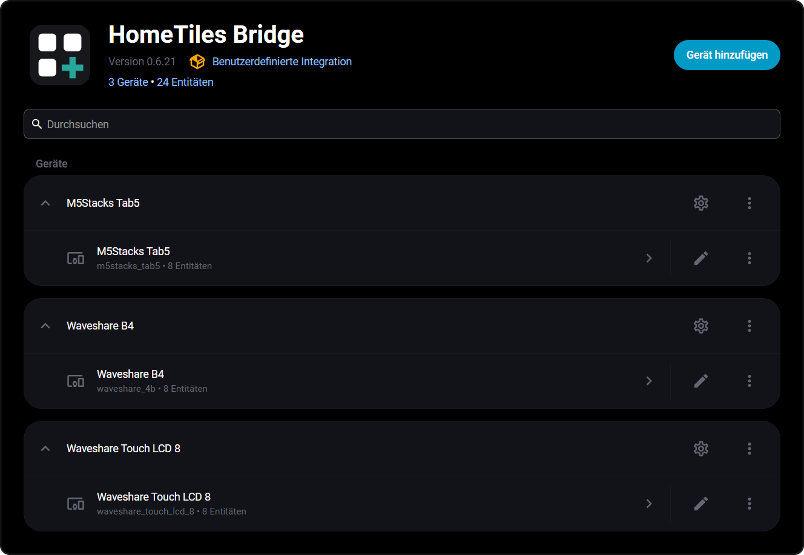

# Bridge Integration

The [HomeTiles Bridge](https://github.com/GalusPeres/HomeTiles-Bridge)
is the Home Assistant side of the project: a custom integration that pushes entity
states, icons, sensor history, weather forecasts, and energy data to the displays via
MQTT, and executes the light/switch/media/scene commands coming back.

Every display appears as its own device under the integration — with its base topic
and status entities — no matter how many panels you run:

{ width="88%" }

## Requirements

- Home Assistant 2025.11 or newer
- An MQTT broker configured in Home Assistant (see the [setup guide](home-assistant-setup.md))

## Installation

### Via HACS (recommended)

1. **HACS → Integrations → three-dot menu → Custom repositories**
2. Repository: `https://github.com/GalusPeres/HomeTiles-Bridge`,
   category **Integration**, click **Add**
3. Search for **HomeTiles Bridge** in HACS and download it
4. Restart Home Assistant

Updates arrive through HACS like for any other custom integration.

### Manual

Copy the `custom_components/tab5_lvgl` folder from the repository into your
Home Assistant `custom_components` directory and restart Home Assistant.

## Adding A Panel

Add the integration once via **Settings → Devices & Services → Add Integration**
(search for **HomeTiles Bridge**):

| Field | Meaning |
| --- | --- |
| Base topic | MQTT namespace of the panel — must match the display's **Device topic base** (web admin → Settings → MQTT). **Unique per panel.** |
| HA prefix | Topic prefix for entity state publishing (default `ha/statestream`) — same on all panels and displays. |
| Device name / manufacturer / model | Optional metadata shown in the device registry. |

**Additional panels are discovered automatically:** every display announces itself over
MQTT when it connects. The first announcement links up with your manually created entry;
any further display gets its own integration entry without manual steps. A display that
went missing (for example after being deleted in Home Assistant) can re-announce itself
at any time via its on-device **Settings → System → Pairing** button.

## Configuration

Open the integration entry and click **Configure**. Three sections:

### Panel Settings

Base topic, HA prefix, and device metadata — same fields as above.

### Entity Configuration

Select which entities the displays may use:

- **Sensors** — any entity whose state you want on sensor tiles
- **Weather** — `weather` entities for weather tiles/forecasts
- **Lights / Switches / Climate / Media players** — controllable from the displays
- **Scenes & scripts** — each selected entry gets an auto-generated **alias**
  (used by scene tiles); you can also map aliases manually in the text box,
  one `alias=entity_id` per line

Entity selections are **shared across all panels** — every display can use every
entity configured here.

### Energy Dashboard

Enable electricity, gas, and/or water. The displays' energy tiles pull their statistics
from the Home Assistant [Energy Dashboard](https://my.home-assistant.io/redirect/energy/),
so that must be configured first. These checkboxes are synchronized across all panel
entries.

## MQTT Topics Reference

For debugging with an MQTT client (topic layout, `{id}` = panel device id):

| Topic | Direction | Description |
|---|---|---|
| `<base>/stat/connected` | Display → HA | Connection status |
| `tab5_lvgl/config/{id}/bridge/apply` | HA → Display | Full configuration push |
| `tab5_lvgl/config/{id}/bridge/icons` | HA → Display | Lightweight icon updates |
| `tab5_lvgl/config/{id}/history/*` | Both | Sensor history request/response |
| `tab5_lvgl/config/{id}/weather/*` | Both | Weather forecast request/response |
| `tab5_lvgl/config/{id}/energy/*` | Both | Energy data request/response |
| `<base>/cmnd/light` | Display → HA | Light control commands |
| `<base>/cmnd/switch` | Display → HA | Switch control commands |
| `<base>/cmnd/media` | Display → HA | Media player commands |
| `<base>/cmnd/climate` | Display → HA | Climate target temperature and HVAC mode |
| `<base>/cmnd/scene` | Display → HA | Scene/script activation |

Entity states are published under `<HA prefix>/<entity>/...` by the bridge itself —
Home Assistant's MQTT Statestream integration is **not** required.
