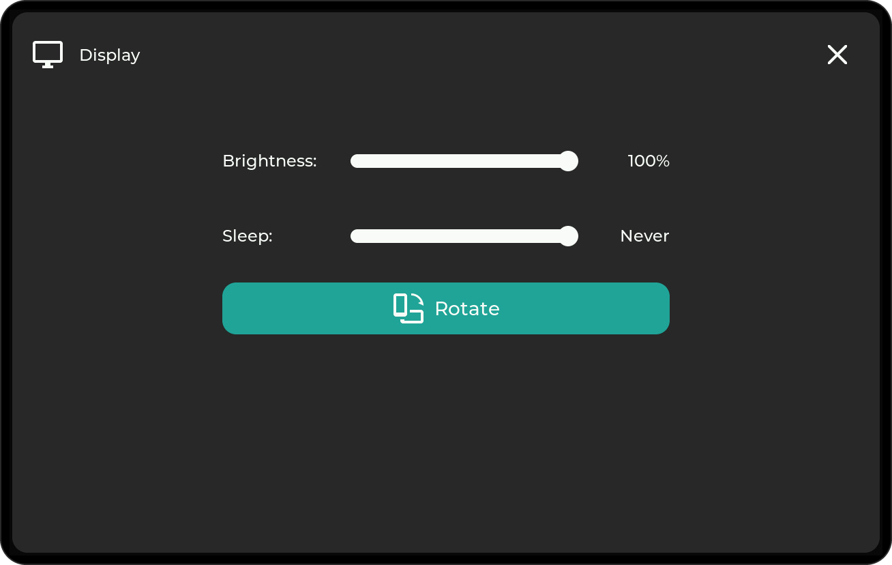
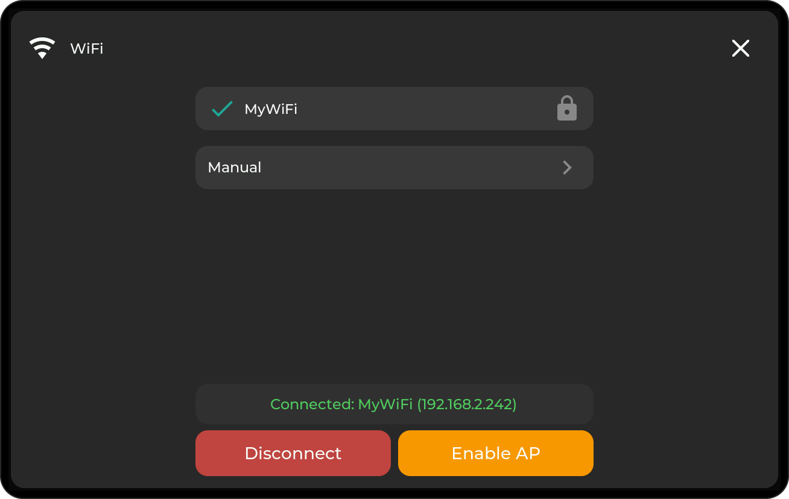
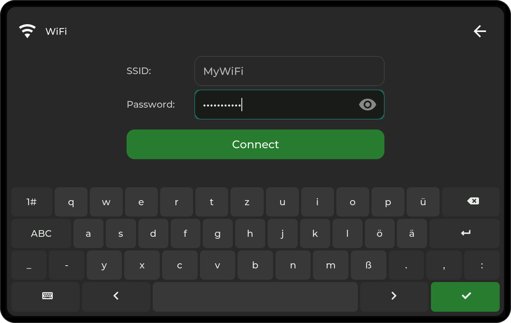
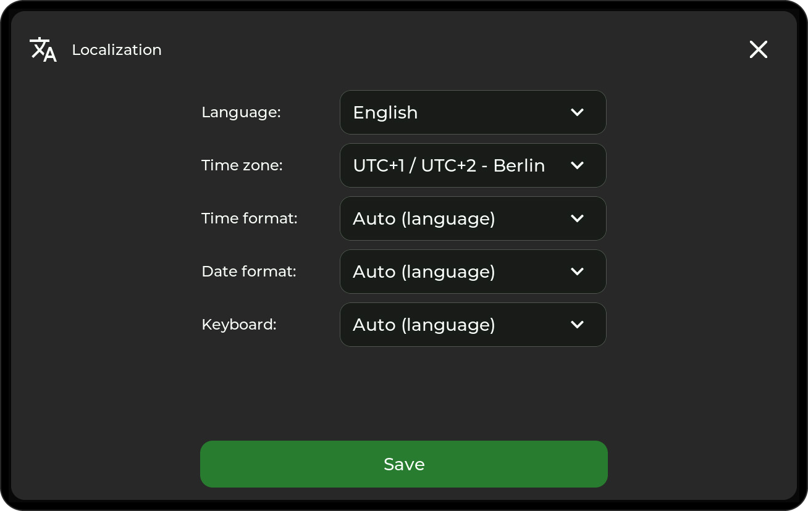
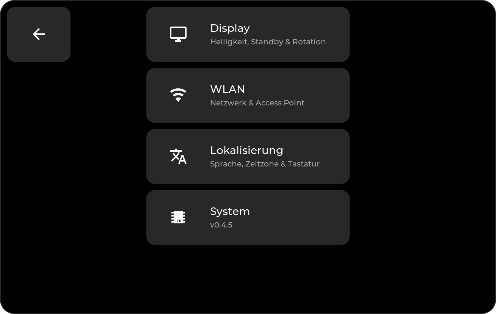

# On-Device UI

The display itself is touch-first: tap tiles to switch things, open folders, and
bring up detail popups. Everything shown here is configured in the
[web admin panel](web-admin.md) — the device is for using the dashboard, not
building it.

{ width="70%" }

Folders open as full-screen sub-pages with their own grid; the back tile in the
top-left corner returns to the previous page.

{ width="70%" }

## Popups

Data tiles open a detail popup — on a tap or a long press, configurable per tile
in the web admin.

### Light Control

Switch tiles bound to a `light` entity get the full control set. The icon row at
the bottom switches between the views; the power button toggles the light.

{ width="32.8%" }
{ width="32.8%" }
{ width="32.8%" }

Brightness is a drag slider, color is a full color wheel, and **K** selects the
white color temperature. Views only appear if the light supports them.

### Sensor History

Sensor tiles chart their history — fetched live from Home Assistant through the
bridge — with a 24-hour and a 7-day view.

{ width="70%" }

### Energy Statistics

Energy tiles chart the Home Assistant Energy Dashboard statistics: hourly bars for
the day view, daily bars for the week view.

{ width="49.5%" }
{ width="49.5%" }

### Weather

Current conditions plus the forecast ahead: daily min/max with an hourly
temperature curve, precipitation, and rain probability. The arrows page through
the coming weeks.

{ width="70%" }

### Media

Media tiles show cover art and what's playing; the popup adds transport controls
and a volume slider.

{ width="70%" }

## Settings

The settings tile (gear icon) opens the on-device settings menu:

{ width="70%" }

### Display

Brightness, sleep timeout (up to *Never*), and a rotate button that turns the
whole UI by 180° — for mounting the display upside down.

{ width="70%" }

### WiFi

The list shows found networks; the connected one is checked, and the status bar
shows the current IP address — that's the address of the
[web admin panel](web-admin.md).

{ width="70%" }

- **Disconnect** drops the connection without deleting the saved credentials.
  The device stays offline until you connect again or restart it.
- **Enable AP** starts a hotspot with an on-screen QR code — connect to it and a
  captive portal asks for your WiFi credentials. This is the way in when the
  device isn't on your network yet.
- **Manual** lets you type an SSID and password directly, with an on-screen
  keyboard:

{ width="70%" }

### Localization

Language (English/German), time zone, time and date format, and the on-screen
keyboard layout. Everything follows the language automatically unless overridden —
the whole UI switches, including the settings and all popups.

{ width="49.5%" }
{ width="49.5%" }

### System

Firmware version, device name, and the maintenance actions:

{ width="70%" }

- **Check for updates** looks up the latest GitHub release and installs it
  directly on the device — see [Firmware Updates](updating.md).
- **Restart** reboots the device.
- **Pairing** re-announces the device to Home Assistant: it reconnects MQTT and
  republishes its discovery data. Use it if the device is missing in Home
  Assistant — for example after you deleted it there — without touching any
  settings.
- **GitHub** shows a QR code linking to this project.
