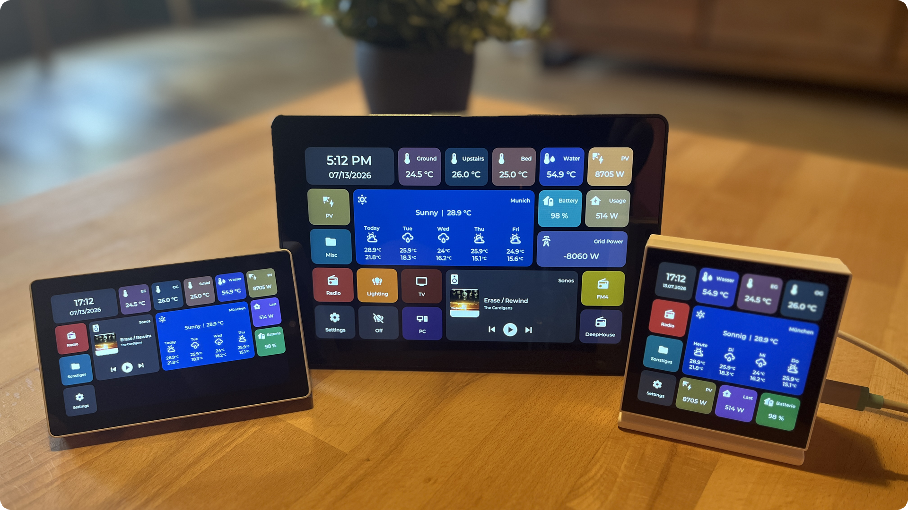

# HomeTiles

Tile-based firmware that turns ESP32-P4 touch displays into Home Assistant control
panels — configured entirely in the browser, updated over the air, connected via MQTT.

{ width="82%" .ht-hero }

## Demo

<video class="ht-demo" controls playsinline preload="metadata" poster="images/hometiles-demo-poster.jpg" aria-label="HomeTiles device demo">
  <source src="videos/hometiles-demo.mp4" type="video/mp4">
</video>

[Download the demo video](videos/hometiles-demo.mp4)

{ width="100%" .ht-hero }

## New Here? Three Steps

1.  **Connect everything**

    Set up the MQTT broker, install the bridge integration, flash the firmware,
    and pair the display with Home Assistant.

    [Home Assistant Setup :octicons-arrow-right-24:](home-assistant-setup.md)

2.  **Build your dashboard**

    Open the display's admin panel in your browser: click a cell, pick a tile
    type, done. Drag & drop, folders, everything saves automatically.

    [Web Admin Panel :octicons-arrow-right-24:](web-admin.md)

3.  **Use the display**

    Control lights with a color wheel, check sensor history, energy statistics,
    weather, and media — all in touch popups on the device.

    [On-Device UI :octicons-arrow-right-24:](device-ui.md)

Looking for something specific? [Tile Types](tiles.md) ·
[Firmware Updates](updating.md) · [FAQ & Troubleshooting](faq.md) ·
[GitHub](https://github.com/GalusPeres/HomeTiles)

## Supported Devices

| Device | Display |
| --- | --- |
| [M5Stack Tab5](https://shop.m5stack.com/products/m5stack-tab5-iot-development-kit-esp32-p4) | 5" 1280×720 |
| [Waveshare ESP32-P4-WIFI6-Touch-LCD-4B](https://www.waveshare.com/esp32-p4-wifi6-touch-lcd-4b.htm) | 4" 720×720 |
| [Waveshare ESP32-P4-WIFI6-Touch-LCD-8](https://www.waveshare.com/esp32-p4-wifi6-touch-lcd-7-8-10.1.htm) | 8" 1280×800 |

The same firmware runs on all devices; every release ships prebuilt binaries for each.

## How It Works

  Display
  ←&thinsp;MQTT&thinsp;→
  MQTT Broker
  ←&thinsp;MQTT&thinsp;→
  Bridge Integration<small>Home Assistant</small>

The display never talks to Home Assistant directly. The
[bridge integration](bridge.md) pushes entity states, icons, weather, history,
and energy data over MQTT — and executes the commands the display sends back.
Firmware and bridge are MIT-licensed and developed together.
