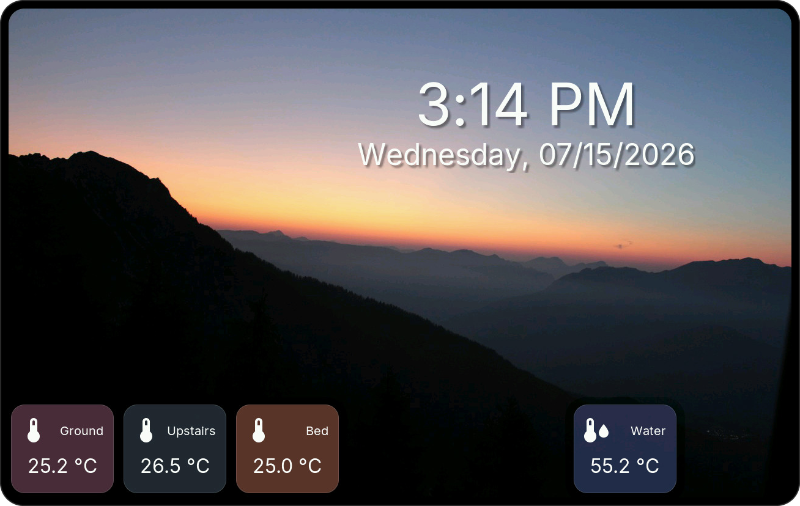
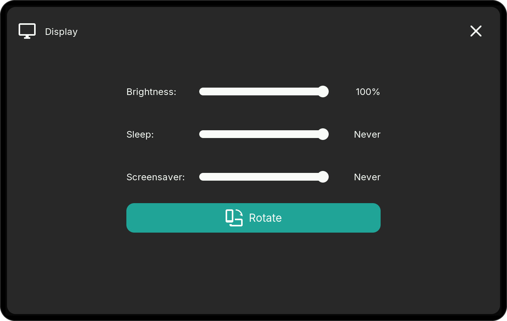
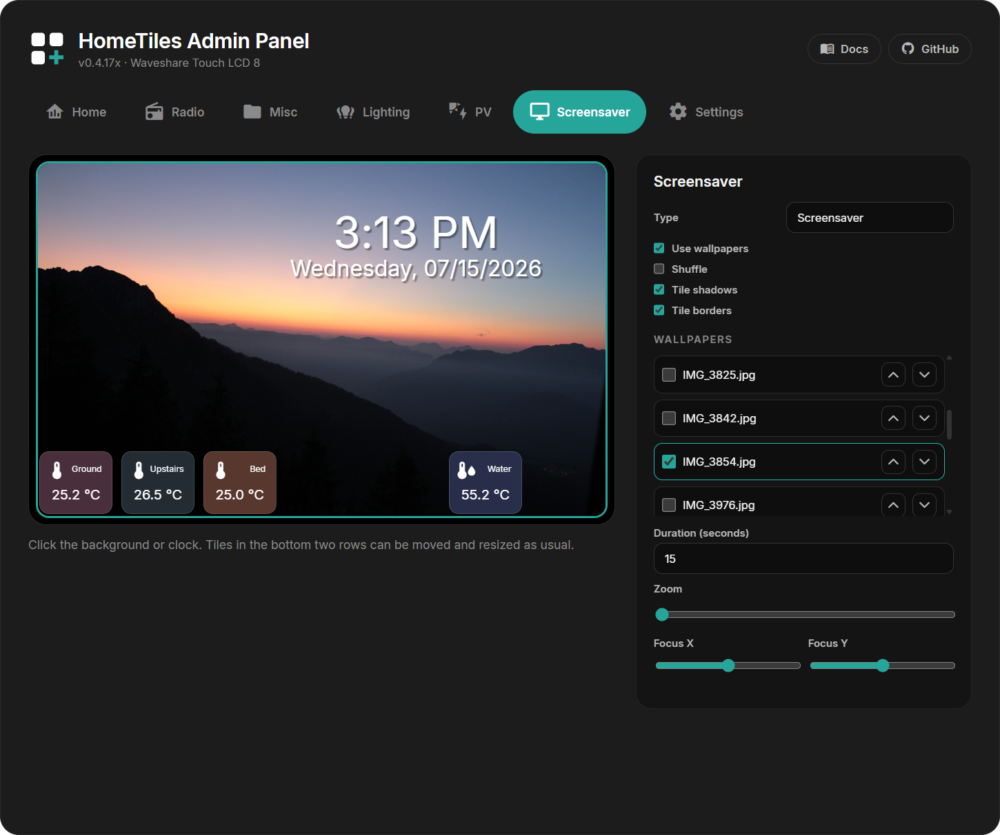

# Screensaver

HomeTiles v0.5.0 adds a separate screensaver layout with an image slideshow,
a freely positioned clock, and optional Home Assistant tiles. It is configured in
the **Screensaver** tab of the web admin and runs on every supported display.

{ width="82%" }

## Prepare the microSD Card

1. Format a microSD card as FAT32 and insert it into the display.
2. Create a folder named `images` in the root of the card, so its path is `/images`.
3. Copy JPEG files (`.jpg` or `.jpeg`) into that folder. The web admin file manager
   can upload several selected files at once.
4. Open or reload the **Screensaver** tab. The images appear in the wallpaper list.

Images should be at least as large as the target display. For the 8-inch model,
1280×800 or larger is recommended. The firmware preserves the source aspect ratio
and crops it to the display; **Zoom**, **Focus X**, and **Focus Y** control that crop.

Without a card or usable JPEG, the screensaver still works with a black background
and the configured clock and tiles.

## Open It Manually or Automatically

- Tap any **Clock** tile on the normal dashboard to open the screensaver immediately.
- To activate it after inactivity, open **Settings → Display** on the device and set
  the **Screensaver** slider. This timeout is separate from the display sleep timeout.
- Tap the free image/background area to return to the dashboard.

{ width="70%" }

## Configure the Slideshow

Open `http://<display-ip>/` and select the **Screensaver** tab. Click the image
background to select the slideshow settings.

| Setting | What it does |
| --- | --- |
| **Use wallpapers** | Enables the image background; disabled means black background |
| **Shuffle** | Chooses the next enabled image randomly instead of using list order |
| **Tile shadows** | Adds shadows below the overlay tiles |
| **Tile borders** | Adds a subtle modern outline around overlay tiles |
| **Wallpaper checkboxes** | Include or exclude individual JPEG files |
| **Arrow buttons** | Set the slideshow order |
| **Duration** | Global display time in seconds for every image |
| **Zoom** | Enlarges the selected image while preserving its aspect ratio |
| **Focus X / Focus Y** | Moves the crop horizontally or vertically |

Changes save automatically and are applied live on the display.

## Position the Clock

Click the clock in the preview to open its settings. Drag the clock anywhere on
the image and use its resize handle to set the available text area; it is not tied
to the tile grid. Time and date can be enabled independently, with an optional
weekday, separate font sizes and formats, left/center/right alignment, and text
shadow.

## Add Tiles

The bottom two rows are regular screensaver tile slots. Select an empty slot, choose
Sensor, Energy, Switch, Scene, or Media, then drag and resize it exactly as on a
normal folder page. Color and **Opacity** are configured together; the reset button
restores both. Sensor and Energy values remain live while the screensaver is open.
Popups are not opened in screensaver mode, so touches act directly on supported
controls or leave the overlay stable.

!!! warning "Media tiles"
    Media tiles are supported and use a minimum size of 2×2. Loading and decoding
    cover art adds WiFi, RAM, and rendering work, so entering the screensaver or
    changing slides can be slower than with Sensor, Energy, or Switch tiles. On
    memory-constrained layouts, use only one media tile or omit it for the smoothest
    slideshow.

## Backup and Restore

Web-admin **Export** includes the screensaver layout and settings together with all
folders and tiles. Imports from older HomeTiles versions remain compatible: if an
old JSON file has no screensaver section, the current screensaver is left unchanged.
