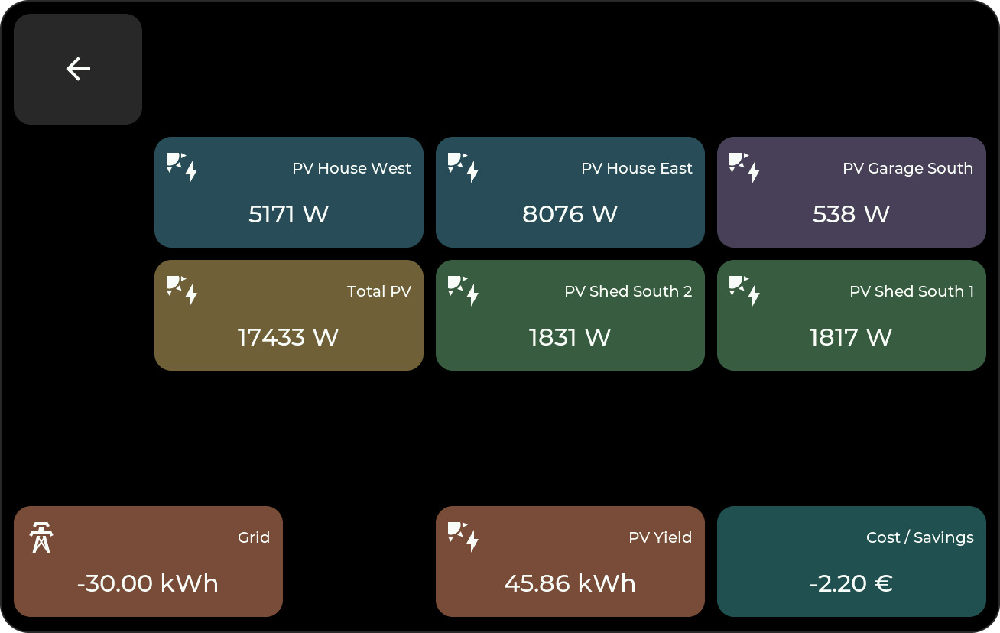

# Tile Types

Everything on the dashboard is a tile on a grid. Tiles are created, moved, resized, and
configured in the [web admin panel](web-admin.md) — click a cell, pick a type from the
dropdown, fill in its fields:

{ width="340" }

Tiles that show Home Assistant data need their entity to be exposed through the
[bridge integration](bridge.md) first. Most data tiles open a detail popup — whether on
a **tap** or a **long press** is configurable per tile in the web admin.

## Home Assistant Tiles

### Sensor

Shows the current value of any Home Assistant entity, with icon, title, and unit.

**Config:** entity, unit, decimals, value size, and an optional display mode that turns
the tile into a gauge (with min/max range).

**Popup:** a history chart with a 24-hour and a 7-day view — the data is fetched live
from Home Assistant through the bridge.

{ width="65%" }

### Energy

Shows a value from the Home Assistant **Energy Dashboard** — solar yield, grid
import/export, battery, gas, water, or cost/savings. Requires the matching energy
category to be enabled in the [bridge options](bridge.md#energy-dashboard) and a
configured Energy Dashboard in Home Assistant.

On the grid, energy tiles look exactly like sensor tiles — the difference is where the
data comes from and what the popup shows. Here, the tiles at the top are **sensor**
tiles (live power right now), the bottom row are **energy** tiles (statistics for the
day so far):

{ width="75%" }

**Config:** energy entity, unit, decimals, value size.

**Popup:** bar charts from the energy statistics — hourly bars in the day view, daily
bars in the week view:

{ width="49.5%" }
{ width="49.5%" }

### Switch

Toggles a `switch` or `light` entity with a tap; the tile reflects the current state.

**Config:** entity, tile style, popup trigger.

**Popup (lights):** the full light control set — brightness slider, color wheel, and
color temperature. The icon row at the bottom switches between the views; views only
appear if the light supports them.

{ width="32.8%" }
{ width="32.8%" }
{ width="32.8%" }

### Scene

Triggers a scene or script with a tap — no popup. The tile references the **scene
alias** defined in the bridge integration (aliases are generated automatically when you
select scenes/scripts in the bridge options, or mapped manually there as
`alias=entity_id`). The scene tiles in the folder screenshot further down
(*Bright*, *Reading*, *Warm*, ...) are typical examples.

### Weather

Shows current conditions from a `weather` entity.

**Popup:** the forecast ahead — daily min/max with an hourly temperature curve,
precipitation, and rain probability; the arrows page through the coming weeks:

{ width="65%" }

### Media

Controls a `media_player` entity: cover art, current title, and playback controls
directly on the tile.

**Popup:** the full control set including previous/next and a volume slider:

{ width="65%" }

### Climate

Controls a Home Assistant `climate` entity for heating, cooling, or air
conditioning. The tile shows the current temperature and changes its icon and
accent color when the device is actively heating, cooling, drying, or running
its fan.

**Config:** climate entity and popup trigger.

**Popup:** a circular target-temperature control with plus/minus buttons and
buttons for every HVAC mode reported by the entity. `heat_cool` entities with a
low/high target range keep that range while the circular control moves its
center.

## Local Tiles

These tiles work without Home Assistant.

### Clock

Time and date. Follows the device's localization settings (language, time zone,
12h/24h); per tile you can toggle time/date separately, set their sizes, and override
the formats.

### Text

A static text tile with selectable font size — useful for headings and labels on
the grid.

### Counter

A simple tap counter: tap to count up, long-press to reset. The start value is
configurable.

### Folder

Opens a sub-page with its own tile grid; a back tile is placed there automatically.
Use folders to group lights, rooms, or feature areas — like this lighting page with
its light switches and scene tiles:

{ width="75%" }

Creating one is a single step — see [Folders](web-admin.md#folders) in the web
admin guide.

### Animation

Plays a low-res pixel-art animation from a `.panim` file in the `/animations` folder
of the microSD card — a purely decorative element. Frame rate, fit, and zoom are
configurable.

### Key

Sends a key/button command to PC clients connected to the display's built-in WebSocket
server (port 8081). This works together with the desktop companion app
(`electron-app/`) to trigger keyboard input or commands on a Windows PC — it is not
related to Home Assistant.

### Empty

A spacer tile for layout purposes.
