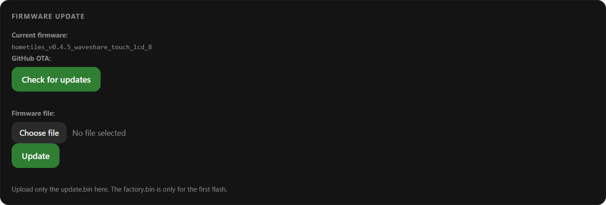

# Firmware Updates

There are three ways to get firmware onto a device. For normal operation you only ever
need the first one.

## 1. On-Device Updater (recommended)

Open **Settings → System** on the display and tap **Check for updates**. The device
looks up the latest [GitHub release](https://github.com/GalusPeres/HomeTiles/releases/latest),
and if a newer version exists, offers to install it. The download and installation run
directly on the device with a progress bar; afterwards it restarts into the new version.

{ width="65%" }

Notes:
- The device briefly disconnects from MQTT and stops the web admin during the install —
  both come back automatically.
- If the install fails (network hiccup, crash), nothing is lost: the device keeps running
  the old version. Just try again.

## 2. Web Admin OTA Upload

Open the [web admin panel](web-admin.md) (`http://<display-ip>/`), go to the Firmware
section, and either run the same GitHub update check from the browser or upload the
update binary manually. During a manual upload the screen turns off — this is
intentional (it frees memory for the transfer) and the device restarts when done.

Use the asset matching your device from the release page:

| Device | OTA update file |
| --- | --- |
| M5Stack Tab5 | `hometiles_<version>_m5stacks_tab5.bin` |
| Waveshare 4B | `hometiles_<version>_waveshare_4b.bin` |
| Waveshare 8" | `hometiles_<version>_waveshare_touch_lcd_8.bin` |

Older devices still running v0.2.9 or earlier look for the previous
`esp32-p4-homeassistant-display-<version>-<device>-update.bin` naming; the on-device
updater falls back to it automatically if a release doesn't have the current-named asset.

## 3. Factory Flash (first installation / full reset)

For a brand-new device or a full reset, flash the `-factory.bin` image over USB — it's
a complete flash image that wipes and reinstalls everything: bootloader, app, and the
stored WiFi/MQTT/tile configuration.

The full walkthrough (tools, files, first boot, re-pairing after a reset) is on the
[Flashing the Firmware](flashing.md) page.

## Building From Source

1. Open `HomeTiles.ino` in the Arduino IDE.
2. Select the target device in `src/devices/device_select.h`.
3. Apply the board settings from [BOARD_SETTINGS.md](https://github.com/GalusPeres/HomeTiles/blob/master/BOARD_SETTINGS.md).
4. Build and flash.

The firmware version comes from `version.txt`. The on-device updater compares this
version against the latest release tag, and expects release assets to follow the naming
scheme shown above.
