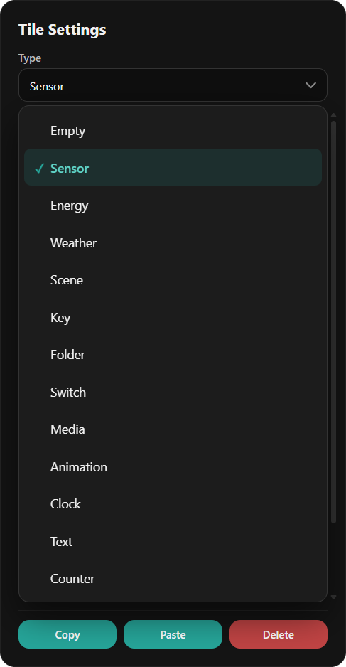
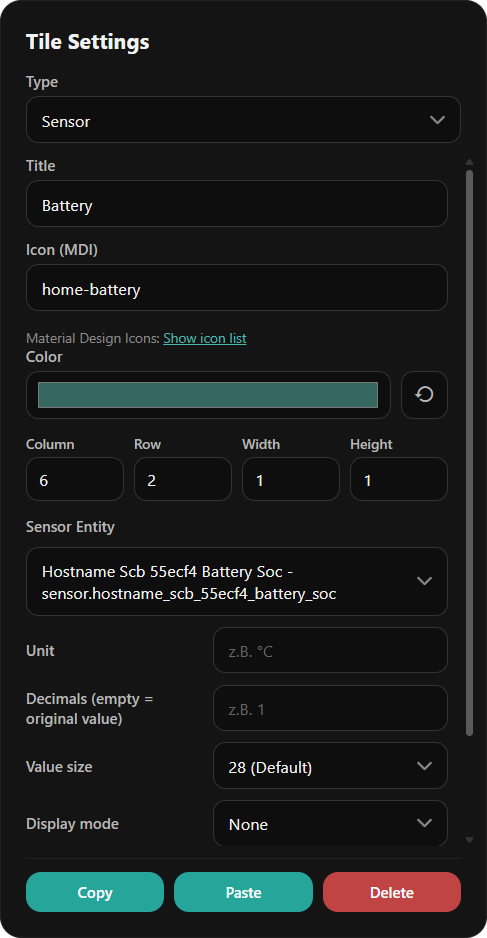
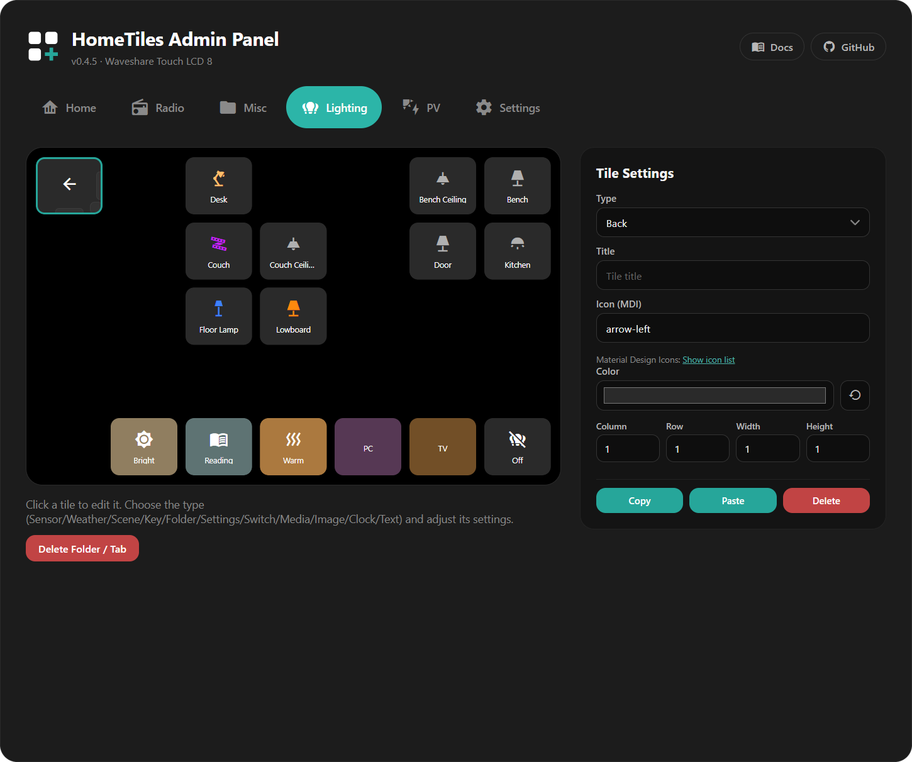
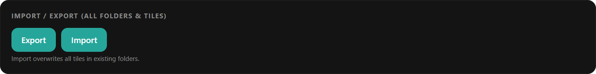

# Web Admin Panel

Every device runs its own admin panel — the whole dashboard is configured in the
browser, nothing on the device itself. Open `http://<display-ip>/` (the IP is shown
on the device under **Settings → WiFi**, and in Home Assistant on the device page).

The layout mirrors the device: on the left a live preview of the tile grid with one
tab per folder, on the right the **Tile Settings** panel for the selected tile.

!!! tip "Changes save automatically"
    There is no save button for tiles. Every edit — title, color, position, type —
    is applied and stored as you make it, and the display updates within a second or two.

## Creating a Tile

1. **Click any empty cell** in the grid. The Tile Settings panel opens for it.
2. Pick a **Type** — the cell immediately becomes that tile.
3. Fill in the fields for that type (they change with the type — a Sensor tile asks
   for an entity, a Clock tile for time/date formats, and so on).

{ width="360" }

Every tile shares the same base settings:

| Setting | What it does |
| --- | --- |
| **Title** | Label shown on the tile (optional) |
| **Icon (MDI)** | Any [Material Design Icon](https://pictogrammers.com/library/mdi/) by name, e.g. `thermometer` — the *Show icon list* link opens the catalog |
| **Color** | Tile background; the reset arrow returns to the type's default |
| **Column / Row / Width / Height** | Position and size on the grid |

Below that come the type-specific fields. For a Sensor tile, for example: the
Home Assistant entity, unit, decimals, value size, and an optional gauge display mode.

{ width="360" }

An overview of all tile types and what each one needs is on the
[Tile Types](tiles.md) page.

## Moving, Resizing, Copying

- **Move** — drag a tile to another cell; a placeholder shows where it will land.
- **Resize** — drag the handles on the tile's right/bottom edge, or type exact
  values into *Width* / *Height*.
- **Copy / Paste** — copy a configured tile and paste it onto another cell (also
  across folders). **Delete** clears the tile back to an empty cell.

## Folders

Set a tile's type to **Folder** and a sub-page is created automatically: it appears
as a new tab in the admin panel, and on the device the tile opens that page — with
a back tile placed in the top-left corner for you.

The folder tab has a **Delete Folder / Tab** button that removes the sub-page and
all tiles on it. The back tile can be restyled (icon, color) but keeps its function.

## Device Settings

The **Settings** tab configures the device itself — the same options as in the
on-device settings, plus a few admin-only ones:

- **WiFi** — network credentials, optional static IP, connection status
- **MQTT** — broker host, port, credentials, topic base. Normally filled
  automatically by [pairing](home-assistant-setup.md); only touch this for a
  manual setup
- **Localization** — language, time zone, time and date format

Unlike tile edits, this form uses the green **Save** button in the footer —
next to it is the device restart button.

## Import / Export

Exports the complete dashboard — all folders and tiles — as a single JSON file;
import restores it. Useful as a backup before bigger layout changes, or to copy
a layout to a second device.

!!! warning
    Import overwrites all tiles in existing folders.

## Screenshot & Diagnostics

**Create & Download Screenshot** saves a JPEG of the current screen to the microSD
card and downloads it in the browser (requires a card).

**Download crash log** fetches `crashlog.txt`: whenever the display crashes or
restarts unexpectedly, the firmware appends the reset reason and a crash summary
(crashed task, program counter, registers) to this file on the next boot. If no
crash has ever been recorded, the button just says so.

After a crash the firmware also keeps a **core dump** — a full snapshot of the
crash — in a dedicated flash partition. When one is stored, the section shows a
summary line plus buttons to download or delete it.

Found a crash? Please [report it](faq.md#the-display-crashed-or-restarted-by-itself) —
the crash log and core dump are exactly what's needed to fix it.

## Firmware Update

The Firmware section checks GitHub for new releases and installs them, or takes a
manually uploaded `update.bin`. Details on all update paths are on the
[Firmware Updates](updating.md) page.

## File Manager

If a microSD card (FAT32) is inserted, a file manager section appears: upload,
download, rename, delete, and folders. The card is optional — it is only used for
the file manager and for screenshot export.
